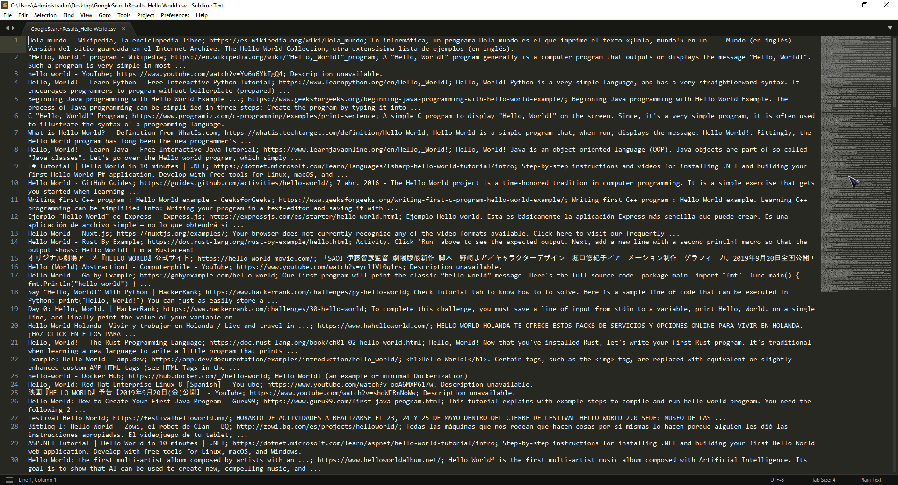

<!-- Common Project Tags:
desktop-app 
desktop-application 
dotnet 
netframework 
netframework48 
tool 
tools 
vbnet 
visualstudio 
windows 
windows-app 
windows-application 
windows-applications 
windows-forms 
winforms 
 -->

# Google Search URL Crawler

### A desktop application that crawls urls from Google's search engine results.

------------------

# ‼️ Limitations

This software makes free usage of Google's search engine via html scraping techniques, it does not use specialized (Google) APIs, so the program is limited to send a small amount of queries per hour until Google start denying any new requests. Blame on Google policy, not this program.

## 🖼️ Screenshots

## 📝 Requirements

- Microsoft Windows OS.
- A network connection.

## 🤖 Getting Started

Download the latest release by clicking [here](https://github.com/ElektroStudios/Google-Search-URL-Crawler/releases/latest),

## 🔄 Change Log

Explore the complete list of changes, bug fixes, and improvements across different releases by clicking [here](/Docs/CHANGELOG.md).

## 🏆 Credits

This work relies on the following technologies and third party libraries: 

 - [.NET Framework](https://dotnet.microsoft.com/en-us/download/dotnet-framework)
 - [HtmlAgilityPack](https://html-agility-pack.net/)
 - [CircularProgressBar](https://github.com/falahati/CircularProgressBar)
 - [WinForm Animation Library](https://github.com/falahati/WinFormAnimation)

## ⚠️ Disclaimer:

This Work (the repository and the content provided in) is provided "as is", without warranty of any kind, express or implied, including but not limited to the warranties of merchantability, fitness for a particular purpose and noninfringement. In no event shall the authors or copyright holders be liable for any claim, damages or other liability, whether in an action of contract, tort or otherwise, arising from, out of or in connection with the Work or the use or other dealings in the Work.

This Work has no affiliation, approval or endorsement by the author(s) of the third-party libraries used by this Work.

## 💪 Contributing

Your contribution is highly appreciated!. If you have any ideas, suggestions, or encounter issues, feel free to open an issue by clicking [here](https://github.com/ElektroStudios/Google-Search-URL-Crawler/issues/new/choose). 

Your input helps make this Work better for everyone. Thank you for your support! 🚀

## 💰 Beyond Contribution 

This work is distributed for educational purposes and without any profit motive. However, if you find value in my efforts and wish to support and motivate my ongoing work, you may consider contributing financially through the following options:

 - ### Paypal:
    You can donate any amount you like via **Paypal** by clicking on this button:

    

 - ### Envato Market:
   If you are a .NET developer, you may want to explore '**DevCase Class Library for .NET**', a huge set of APIs that I have on sale.
   Almost all reusable code that you can find across my works is condensed, refined and provided through DevCase Class Library.

    Check out the product:
    
   

<u>**Your support means the world to me! Thank you for considering it!**</u> 👍
